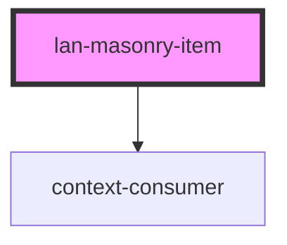

# lan-masonry-item

<!-- Auto Generated Below -->

## Properties

| Property | Attribute | Description | Type                        | Default     |
| -------- | --------- | ----------- | --------------------------- | ----------- |
| `add`    | --        |             | `(el: HTMLElement) => void` | `undefined` |
| `layout` | --        |             | `() => void`                | `undefined` |
| `rm`     | --        |             | `(el: HTMLElement) => void` | `undefined` |
| `size`   | `size`    |             | `string`                    | `undefined` |
| `sizeLg` | `size-lg` |             | `string`                    | `undefined` |
| `sizeMd` | `size-md` |             | `string`                    | `undefined` |
| `sizeSm` | `size-sm` |             | `string`                    | `undefined` |
| `sizeXl` | `size-xl` |             | `string`                    | `undefined` |
| `sizeXs` | `size-xs` |             | `string`                    | `undefined` |

## Dependencies

### Depends on

- context-consumer

### Graph

----------------------------------------------

*Built with [StencilJS](https://stenciljs.com/)*
