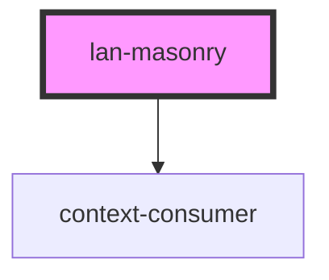

# lan-masonry

<!-- Auto Generated Below -->

## Properties

| Property          | Attribute           | Description | Type      | Default     |
| ----------------- | ------------------- | ----------- | --------- | ----------- |
| `options`         | --                  |             | `Options` | `undefined` |
| `useImagesLoaded` | `use-images-loaded` |             | `boolean` | `false`     |

## Events

| Event            | Description | Type               |
| ---------------- | ----------- | ------------------ |
| `layoutComplete` |             | `CustomEvent<any>` |
| `removeComplete` |             | `CustomEvent<any>` |

## Methods

### `appended(element: HTMLElement) => Promise<void>`

#### Returns

Type: `Promise<void>`

### `destroy() => Promise<void>`

#### Returns

Type: `Promise<void>`

### `getItemElements() => Promise<any>`

#### Returns

Type: `Promise<any>`

### `layout() => Promise<void>`

#### Returns

Type: `Promise<void>`

### `masonry() => Promise<void>`

#### Returns

Type: `Promise<void>`

### `reloadItems() => Promise<void>`

#### Returns

Type: `Promise<void>`

### `rm(element: HTMLElement) => Promise<void>`

#### Returns

Type: `Promise<void>`

## Dependencies

### Depends on

- context-consumer

### Graph

----------------------------------------------

*Built with [StencilJS](https://stenciljs.com/)*
